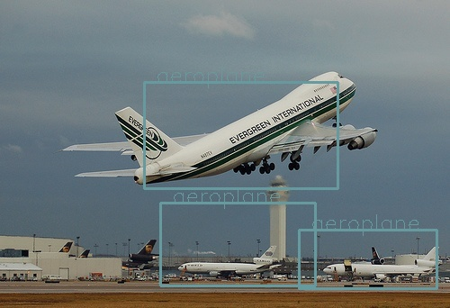

# yolov1-pytorch
[简体中文](README-zh)

This repo is a pytorch-implementation of yolov1 model. (paper reproduction)

* the repo references https://github.com/ivanwhaf/yolov1-pytorch
* Paper: [https://arxiv.org/pdf/1506.02640.pdf](https://arxiv.org/pdf/1506.02640v5.pdf)

# Demo

## Run in command line

`inference.py` runs inference on a variety of sources, cd your project path and type:

```bash
$ python inference.py -w weights/last.pth --source 0  # if 0, use your own camera
```


# Usage

## Preparation

* 1.Create an empty folder named 'dataset' to store your trainging data
* 2.Organize directories, you should move images folder and labels folder into dataset folder. Each image must have
  corresponding same-name `.txt` label in labels folder. Each label file has several rows, each row represents an
  object, each object has `x,y,w,h,c` five values, which represents `center_x, center_y, width, height, class`. The
  coord value should be normalized to `0~1`  
 ](data/xywh.jpg)
* 3.Your dataset folder should be like this:

```
dataset/{dataset name}/
  ├──images
  |   ├──001.png
  |   ├──002.png
  |   └──003.jpg
  └──labels 
      ├──001.txt
      ├──002.txt
      └──003.txt
```
*   4.How to generate '.txt' files

```
python modify_label.py
```
before executing the above command, you need to set the path correctly


## Train

* 1.Edit `cfg/yolov1.yaml` config file, and set **num_classes** according to class number of dataset (this repo
  num_classes=10)
* 2.Edit `cfg/dataset.yaml` config file, and set **class_names** as class names, set **images** as dataset images path,
  set **labels** as dataset labels path
* 3.Modify **epochs**, **learning rate**, **batch size** and other hyper parameters in `train.py` depending on actual
  situations
* 4.Run `train.py` to train your own yolov1 model:

```bash 
$ python train.py 
```

](data/batch0.png)

## Caution


* Validation and test periods are among training process, see train.py for more details
* You can also imitate `models/model.py` customizing your own model

## Program Structure Introduction

* cfg: some yolo and dataset config files
* data: some samples and demo jpgs
* dataset: your own dataset path
* models: some network model structure files
* utils: some util and kernel files
* output: output file folder
* weights: model weights

# Requirements

Python 3.X version with all [requirements.txt](https://github.com/ivanwhaf/yolov1-pytorch/blob/master/requirements.txt)
dependencies installed, including `torch>=1.2`. To install run:

```bash
$ pip install -r requirements.txt
```
